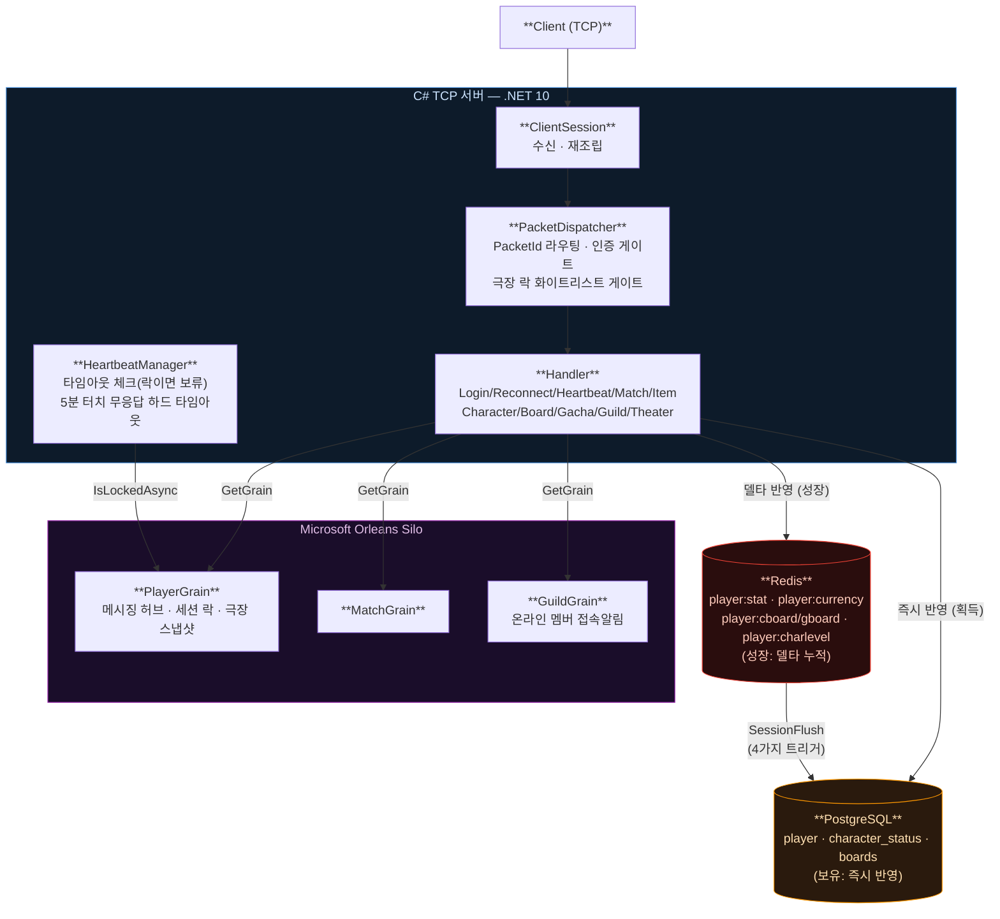

# Trickcal-Bottleneck-Server

에피드게임즈의 트릭컬 리바이브에서 발생할 수 있는 서버 병목 현상을 예상하고 해결 방안을 설계해보는
프로젝트입니다. 트릭컬 리바이브의 실제 서버 로직과는 무관하며, 서버 프로그래밍의 설계와 구조를
익히기 위한 개인 학습용 리포지토리입니다.

목적은 콘텐츠 폭 확장이 아니라 **"게임의 병목을 지우는 것"** — 복잡한 로직이 필요해지는 결투장·
랭크업 시스템 등을 제외함.

[C# 버전 이전 프로젝트(Game-Server-CSharp)](https://github.com/Sewqp/Game-Server-CSharp)의 후속작으로,
완전히 새 저장소로 시작했지만 기술 스택과 코딩 컨벤션은 이어받습니다.

---

## 기술 스택

| 분류 | 기술 |
|---|---|
| 언어 / 플랫폼 | C# / .NET 10.0 |
| 네트워크 | TCP 소켓 (async/await) |
| 분산 처리 | Microsoft Orleans |
| DB | PostgreSQL 18.x(로컬 네이티브) / 16.x(docker-compose), Redis |
| 관측성 | OpenTelemetry SDK → Elastic APM Server (docker-compose 구성만, 미검증) |
| 배포 | Docker, Docker Compose |

---

## 핵심 아키텍처 — "보유"와 "성장"의 분리

이 서버의 데이터 저장 방식은 성격에 따라 완전히 다른 두 경로를 씁니다.

| | 보유 (캐릭터 신규 획득) | 성장 (레벨 · 보드 해금 · 전투력 · 재화) |
|---|---|---|
| 기준값 | PostgreSQL, **즉시 반영** | Redis, **델타 누적** |
| 이유 | 위변조 방지가 중요한 일회성 이벤트 | 매 순간 바뀌는 값 — redis로 부하 절감 |
| PostgreSQL 반영 시점 | 트랜잭션 즉시 | 세션 종료 4가지 트리거(하트비트 타임아웃 · 강제종료 · 정상종료 · 서버종료) 시 `SessionFlush`가 일괄 flush |

가챠·극장(스토리)처럼 "처리 완료까지 재접속 판정을 멈춰야 하는" 기능은 `PlayerGrain`(Orleans)의
락 상태 하나를 공유합니다 — 세션이 아니라 그레인에 두는 이유는, 분산 환경에서 단일 진실 소스가 될 수
있는 건 세션이 아니라 그레인이기 때문입니다.

---

## 구현 현황 (2026-08-13 기준)

**서버 사이드 전체 구현 + 동접 검증 + 백로그 정리까지 완료.**

- **DB 레이어** — `player`/`item_*`(재사용), `character_info`/`character_status`/`player_stat`/
  `character_board`류/`player_currency`(신규), Repository 9종(전투력 계산기 `CombatPowerCalculator` 포함)
- **Network/Packet** — TcpServer/ClientSession/PacketDispatcher 등 이전 프로젝트 패턴 그대로 재사용,
  극장 락 화이트리스트 게이트 추가
- **Handler** — Login/Reconnect/Heartbeat/Match/Item(재사용) + Character/Board/Gacha/Guild/Theater(신규)
- **Grain** — `PlayerGrain`(메시징 허브 + 세션 락 + 극장 스냅샷 + 터치 기반 하드 타임아웃 판정),
  `MatchGrain`(재사용), `GuildGrain`(신규, 접속/해제 알림 전용)
- **테스트 클라이언트** — `DummyClient`(접속/스트레스, 3만 명 검증 완료), `ScenarioClient`(가챠·강화·
  보드·극장·길드 기능 시나리오, 동시 다중 플레이어 지원)

**동시성 검증 결과 (2026-08-10, `rampUp 3000` 기준):**

| 시나리오 | 결과 |
|---|---|
| `DummyClient --count 30000 --rampUp 3000 --duration 30` | `connectFailed=0, loginOk=30000, hbAck=39117` 전원 성공 |
| `ScenarioClient --players 100`(동시 스폰, 전원 동일 길드명으로 생성 시도) | `loginOk=100 gachaOk=100 theaterOk=100 theaterTampered=0 guildCreateOk=1 failed=0` — 100명 경합에도 길드는 정확히 1명만 생성 성공 |

**전투력 연결 검증 (2026-08-12):** 신규 플레이어 가챠 직후 `redis-cli GET player:stat:{id}` →
0이 아닌 값(예: `1330`)으로 정상 계산 확인. 보드/강화 경로의 델타 가산은 초기 재화가 엘리프뿐이라
이 시나리오로는 아직 실기동 미검증(재화 지급 수단 필요 — 백로그).

**극장 락 하드 타임아웃 검증 (2026-08-13):** 임계값을 15초로 낮춰 터치 없이 30초 관람 시나리오
실행 → 정확히 15초 시점에 서버가 세션을 강제 종료하는 것 확인(로그 `Lock idle timeout` 발동 →
EXIT 요청 전 클라 강제 종료). 검증 후 임계값 300초(5분)로 원복.

**남은 백로그:**
- 보드 해금 · 강화 경로의 combatPower 델타 가산 실기동 미검증(가챠 외 재화 지급 수단 없음)
- 관측성 스택(OpenTelemetry → Elastic APM) — docker-compose 구성만 되어있고 실제 기동/OTLP 수신 미검증
- `ScenarioClient`에 극장 터치 신호 전송 미구현 — 정상 시나리오에서 하드 타임아웃 경로가 자연스럽게
  커버되지 않음(지금은 임계값을 임시로 낮춰서만 검증)

---

## 데이터 흐름

---

## 설계 문서

- [`docs/design-plan-draft.md`](docs/design-plan-draft.md) — DB 스키마 · 전투력 공식 · 보드 시스템 ·
  세션(스토리 락, redis→PG flush) 아키텍처. 최신 확정 소스(rev.3, 2026-08-07)
- [`docs/server-arch-note.md`](docs/server-arch-note.md) — 최초 문제 진단과 논의 기록(2026-08-05),
  배경 참고용
- [`DB/schema.sql`](DB/schema.sql) / [`DB/seed_characters.sql`](DB/seed_characters.sql) — 스키마 및
  테스트용 캐릭터 시드(가상 캐릭터 4종, 실제 콘텐츠와 무관)

---

## 트러블슈팅

동접 처리 단계에서 코드 리뷰와 실기동 검증 중 실제로 발견·수정한 문제들.

**1. 극장 락 우회 결제 버그 (2026-08-10, 코드 정적 분석으로 발견)** — `PacketDispatcher`엔 로그인
인증 게이트만 있고 극장 락 기반 게이트가 없어서, `THEATER_ENTER → BOARD_UNLOCK(또는 강화) →
THEATER_EXIT` 순서로 패킷만 보내면 보드 해금·레벨업은 DB/Redis에 그대로 반영되면서 재화만 극장
진입 시점 스냅샷으로 환불되는 결제 우회가 가능했음. "정상 UI는 이 경로를 안 만든다"는 반론도
있었지만, 클라이언트를 못 믿는 걸 전제로 한 위변조 방지 프로젝트라는 원칙에 따라 수정 확정.
`PacketDispatcher`에 화이트리스트 게이트(`AllowedWhileLocked`)를 추가해 락이 걸린 동안은 지정된
몇 개 패킷(퇴장/하트비트/재접속/터치) 외 전부 핸들러 도달 전에 드롭하도록 구조를 바꿈 — 새 핸들러를
추가해도 기본값이 "락 중엔 차단"이라 개별 체크를 깜빡할 위험이 없음.

**2. docker-compose 초기화 실패 — SQL 파일 실행 순서 문제 (2026-08-10)** — `docker-entrypoint-initdb.d`
아래 `.sql`은 알파벳순 자동 실행되는데, Npgsql 파라미터 템플릿(`$1`/`$2`)이라 직접 실행 불가한
`queries_bulk_insert.sql`이 `schema.sql`보다 먼저 실행되면서 초기화 전체가 중단됨. `docs/` 아래로
옮겨 문서 전용으로 분리해 해결.

**3. 포트/환경변수 충돌 — 엉뚱한 Redis/Postgres에 연결 (2026-08-10)** — Windows 네이티브
redis-server/postgres 서비스(이전 Game-Server-CSharp용)가 이미 6379/5432를 점유 중이었는데,
`docker-compose ps`의 "healthy" 표시는 컨테이너 내부 진단이라 실제 호스트 포트 라우팅을 증명하지
못해 서버가 네이티브 서비스로 붙고 있는 걸 놓칠 뻔함(`netstat`/`Get-Process`로 실제 연결 확인).
포트를 postgres 5433/redis 6380으로 분리하고, 환경변수도 `TRICKCAL_POSTGRES_CONN`/
`TRICKCAL_REDIS_CONN`으로 이전 프로젝트와 완전히 분리.

**4. DummyClient 3만 명 램프업 미달 — 스레드풀이 아니라 타이머 오차 누적 (2026-08-10)** —
`--rampUp 1500`으로 27,000명 선에서 정체. `ThreadPool.SetMinThreads`로 스레드 여유를 늘렸더니
오히려 더 나빠짐(16코어에 과도한 스레드는 컨텍스트 스위칭 비용만 늘어남). 실제 원인은 램프업
루프의 `Task.Delay(1000)`이 Docker Desktop/WSL2 상시 구동 등 백그라운드 부하로 매회 조금씩
더 걸리고, 그 오차가 배치 횟수만큼 누적된 것 — 배치 수가 적을수록(`rampUp` 값이 클수록) 누적
오차가 작아짐. `--rampUp 3000`으로 30,000/30,000 전원 성공.

**5. 신규 계정 시작 재화 없음 (2026-08-10)** — 계정 생성 시 재화 지급 로직이 아예 없어서 매번 새
플레이어로 시작하는 동접 테스트가 가챠 잔액 부족으로 실패할 뻔함. `GetOrCreateByNameAsync`가
신규 생성 여부를 반환하도록 바꾸고, 신규 가입 시 엘리프 1000 지급 추가.

**6. 보드 목록 순서 비결정적 (2026-08-10 발견 → 2026-08-11 수정)** — 100명 동시 테스트에서 대부분
같은 보드가 먼저 나와 가챠 RNG 문제를 의심했으나, 실제 원인은 `SELECT`에 `ORDER BY`가 없어 행
순서가 SQL 표준상 보장되지 않는 것이었음(우연히 일정하게 보였을 뿐). Redis 캐시를 거치는 구조라
SQL에 `ORDER BY`를 추가해도 캐시 히트 경로에서 다시 흐트러질 수 있어, 최종 반환 지점에서
`List.Sort`로 정렬하도록 수정.

**7. 전투력 계산이 어디에도 연결 안 됨 (2026-08-09 발견 → 2026-08-11 수정, 2026-08-12 검증)** —
전투력 환산 공식 자체는 확정돼 있었지만 캐릭터 획득/보드 해금/레벨업 어디서도 이를 호출하는 코드가
없어 `combatPower`가 항상 0으로 나옴. 공식이 선형이라는 점을 이용해 스탯 벡터 전체 재계산 없이
델타 하나만 더해도 동일한 증가분이 나오는 `CombatPowerCalculator`를 만들어 가챠/보드/강화 3곳에
연결. redis-cli로 직접 조회해 0이 아닌 값이 정상 계산됨을 확인.

**8. 극장 재화 복구의 비원자성 (2026-08-11 수정)** — 극장 퇴장 시 스탯/재화 비교·복구가 4번의
개별 redis 왕복(읽기 2회 + 쓰기 2회)에 걸쳐 있어 이론상 동시 재화 연산과 경합 시 lost update가
가능했음. Lua 스크립트 하나로 두 키(전투력 STRING + 재화 HASH)를 원자적으로 읽고 비교하고
필요시 덮어쓰기까지 처리하도록 변경.

**9. 극장 락이 연결 끊김 시 안 풀리는 문제 (2026-08-13 수정)** — `ClientSession.DisconnectAsync()`가
재화 flush·길드 오프라인 처리는 하면서도 그레인 언락은 호출한 적이 없어, 극장/가챠 처리 중 연결이
끊기면(정상이든 크래시든) 락이 Orleans 기본 유휴 타임아웃(15분)까지 풀리지 않았음. 한 줄 추가로
정상/비정상 종료 양쪽 다 해결. 여기에 "마지막 터치 이후 5분 무응답 시 강제 종료"하는 하트비트
스윕을 별도로 추가해, 연결이 끊기지 않은 채 방치되는 경우까지 커버.

---

## 진행 일지

| 날짜 | 내용 |
|---|---|
| 2026-08-05 | 최초 문제 진단(하트비트/재접속 과다) 논의 |
| 2026-08-06 | 완전히 새 저장소로 시작 결정, DB 스키마 · 전투력 공식 초안 |
| 2026-08-07 | 계획서 rev.3 확정(보드 시스템, 전투력 공식, 세션 아키텍처) |
| 2026-08-08 | 저장소 스캐폴딩, schema.sql 확정, Config/DB/Network/Handler/Grain 전체 구현 (가챠 중복 허용 + 보상, 길드, 극장 위변조 방지 포함) |
| 2026-08-09 | DummyClient/ScenarioClient 작성, GitHub 첫 push, 실기동 E2E 검증(로그인~길드 전체 파이프라인 확인) |
| 2026-08-10 | 동접 처리 착수 — 극장 락 우회 결제 버그 수정, docker-compose/포트/램프업 트러블슈팅, DummyClient 3만 명 · ScenarioClient 100명 동접 검증 완료 |
| 2026-08-11 | 백로그 3건 해결 — 보드 정렬, 전투력 계산 연결, 극장 재화 복구 원자성(Lua 스크립트) |
| 2026-08-12 | 전투력 계산 연결 실기동 검증 완료 |
| 2026-08-13 | 극장 락 하드 타임아웃 안전장치(연결 종료 + 5분 터치 무응답) 구현·검증, 커밋·push 완료 |

---

## GitHub

[Game-Server-CSharp (C# 이전 버전)](https://github.com/Sewqp/Game-Server-CSharp)
